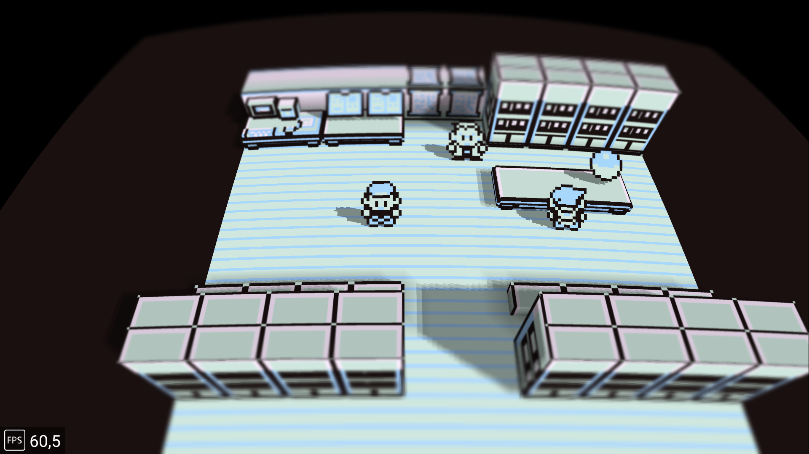

# Kanto Gear

Kanto Gear is a Gen 1 companion for [Gen1Recomp](https://github.com/bryanthaboi/gen1recomp):
the game stays in the main window while maps, party information, battles,
menus and contextual controls move to a second surface.

- **Desktop (Windows / macOS / Linux):** opens a **Kanto Gear** companion
  window when the mod is enabled. Works with official Gen1Recomp builds
  such as [v0.1.69](https://github.com/bryanthaboi/gen1recomp/releases/tag/v0.1.69).
- **Android:** uses a real second display on supported dual-screen handhelds
  (verified on an AYN Thor with the Android test host).

  
  

## What it does

- Shows a touchable Kanto map, party, step counter, field tools, area data and
  an optional guide on the companion surface.
- Moves battle choices, move learning, dialogue choices and PC lists to the
  companion when those screens are active.
- Can hide duplicated battle UI on the main display while the companion is
  ready.
- On Android, offers `AUTO`, `HANDHELD` and `EXTRA SCREEN` display targeting
  for handheld, docked and TV-style layouts. On desktop the companion window
  is used for all of those choices.
- Works with or without the Voxel Mod. On PC, use the official Dramatic Shape
  release; on Android, the performance fork is the recommended 3D option.

## Install on desktop (Windows / macOS / Linux)

You need your own supported Pokemon Red, Blue or Yellow ROM. No ROM or
ROM-extracted game data is included here.

1. Install official Gen1Recomp for your platform from the
   [v0.1.69 release](https://github.com/bryanthaboi/gen1recomp/releases/tag/v0.1.69)
   (`gen1recomp-0.1.69-windows.zip`, `-macos.zip`, or `-linux.zip`).
2. Download the latest `Kanto-Gear-Mod-*.zip` from this repository's releases.
3. Start Gen1Recomp, import your ROM, open **MODS → Import mod .zip**, and
   choose the Kanto Gear zip.
4. Enable **Kanto Gear**, then start the game. A second **Kanto Gear** window
   opens with the companion UI. Click and drag there the same way you would
   tap the lower screen on Android.
5. Optional 3D: import the official
   [Dramatic Shape Voxel Mod](https://github.com/DramaticShape/DramaticShapeVoxelMod)
   from its releases. Do **not** use the Android-only AverageConsumer Voxel
   performance fork on desktop.

Closing the companion window does not quit the game; the next frame present
opens it again while the mod stays enabled.

## Install on Android

> [!IMPORTANT]
> For the complete tested Android experience, use the matched release set:
> the Gen1Recomp Android test APK, Kanto Gear, and the Dramatic Shape Android
> performance fork. The host and Kanto Gear are required; the Voxel fork is
> technically optional but is the recommended 3D renderer for that package.

1. Download `gen1recomp-android-0.1.69-kanto.3.apk` from the
   [Gen1Recomp Android test release](https://github.com/AverageConsumer/gen1recomp/releases/tag/v0.1.69-kanto.3)
   and install it.
2. Download the latest `Kanto-Gear-Mod-*.zip` from this repository's releases.
3. Start **Gen1Recomp Android Test**, import your ROM, open the **MODS** tab,
   tap **Import mod .zip**, and choose the Kanto Gear zip.
4. Make sure **Kanto Gear** is enabled, then start the game. The companion
   appears automatically when Android reports a suitable second display.

The Android test host is published by the Gen1Recomp fork, not by Kanto Gear.
It installs beside the official Gen1Recomp app and does not automatically
reuse that app's ROM cache or saves.

## Optional: Voxel Mod

| Platform | Use |
| --- | --- |
| Desktop | Official [Dramatic Shape Voxel Mod](https://github.com/DramaticShape/DramaticShapeVoxelMod) |
| Android | Optional [performance fork](https://github.com/AverageConsumer/DramaticShapeVoxelMod/releases/tag/v1.6.0-android.1) for handheld frame-pacing |

Kanto Gear does not require Voxel. Both can be enabled together; Kanto Gear
already detects the `DRAMATIC_SHAPE` mod for loading-state UI.

## Using the companion screen

- **Swipe left or right** (or click-drag) to move between the map, party,
  steps, field tools, area information and guide pages.
- **Tap/click the arrows in the header** for the same navigation without
  swiping.
- **SPOILER LOCAL MAP** defaults to **OFF**. **MAP** adds a page with the
  current map or floor; **ENHANCED** also marks exits and uncollected items.
- **Tap/click the visible buttons and list entries** to use touch controls.
- On **PARTY**, tap a card for **STATS** or **SWAP**.
- Battles, menus, dialogue choices and other prompts automatically replace
  the normal page when they need input, then return to it afterward.

## Settings worth knowing

- **BOTTOM SCREEN → AUTO** is the recommended default (desktop companion
  window, or Android auto display pick).
- **HANDHELD** / **EXTRA SCREEN** matter on Android dual-display layouts; on
  desktop they still use the companion window.
- **HIDE UPPER BATTLE UI** removes duplicated battle menus only while the
  companion is ready.
- **FULL BOTTOM BATTLE UI** additionally moves both HP/status panels to the
  companion. The current split layout remains the default.
- **PROFILE → PURIST** hides gameplay-assistance pages; **ENHANCED** enables
  them; **CUSTOM** lets you choose each assist separately.

## Tested hosts

| Platform | Host | Companion |
| --- | --- | --- |
| Windows / macOS / Linux | Official Gen1Recomp [0.1.69](https://github.com/bryanthaboi/gen1recomp/releases/tag/v0.1.69) | Second OS window |
| Android | [0.1.69-kanto.3 test APK](https://github.com/AverageConsumer/gen1recomp/releases/tag/v0.1.69-kanto.3) | Physical second display |

## Known limits

- Desktop needs LuaJIT FFI plus the SDL2 library already shipped with
  Gen1Recomp. The bridge prefers the SDL2 already loaded by the host (important
  on Linux AppImages) and uses a software renderer for the companion on Linux
  so it does not fight the main OpenGL context. If the companion window cannot
  open, check the game log for `desktop bridge inactive`.
- The AYN Thor is the confirmed Android reference device. Comparable Android
  dual-display hardware is intended to work but remains community-tested.
- External-monitor rotation and unusual multi-display Android layouts need
  real-device reports.
- This is active playtest software. Keep a normal exported save backup.

## Reporting a problem

- Companion window, touch/click, or Kanto Gear UI → this repository's issues
- Official Gen1Recomp host problems → [bryanthaboi/gen1recomp](https://github.com/bryanthaboi/gen1recomp/issues)
- Android test host → [AverageConsumer/gen1recomp](https://github.com/AverageConsumer/gen1recomp/issues)
- Official Voxel Mod → [DramaticShape/DramaticShapeVoxelMod](https://github.com/DramaticShape/DramaticShapeVoxelMod/issues)

Please include the OS, Gen1Recomp version, installed mods, what you expected,
what happened, and a screenshot if possible.

## Credits

Kanto Gear is built on [Gen1Recomp](https://github.com/bryanthaboi/gen1recomp).
The optional renderer is
[Dramatic Shape Voxel Mod](https://github.com/DramaticShape/DramaticShapeVoxelMod).
Their progress, code and project direction remain theirs.

Android dual-display support originates from
[AverageConsumer/kanto-gear](https://github.com/AverageConsumer/kanto-gear)
and the matching Android test host. This fork adds the desktop companion
window.

Kanto Gear's own code is available under the [MIT License](LICENSE). That
license does not replace or extend the licenses, rights or ownership of
Gen1Recomp, Dramatic Shape Voxel Mod, Pokemon or their respective assets.

Pokemon and related names are trademarks of their respective owners. This
project is not affiliated with Nintendo, Game Freak, The Pokemon Company,
Gen1Recomp or DramaticShape.
